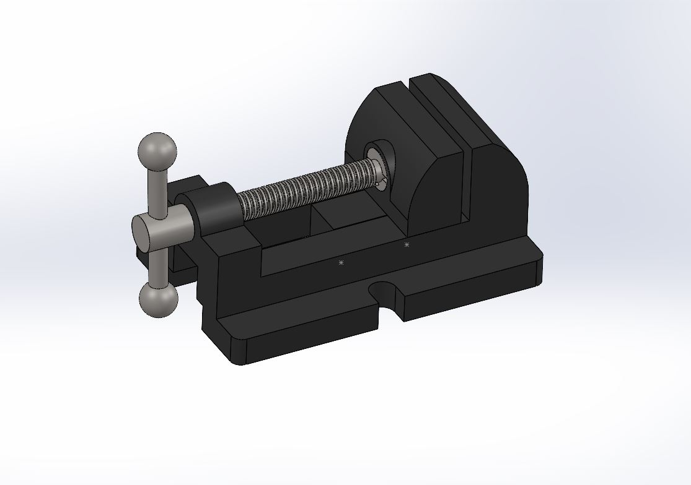

# Mechanical CAD Portfolio

Mechanical Engineering Undergraduate student focusing on CAD, mechanical drafting, and product design.

---

## About Me
I am a Mechanical Engineering undergraduate student interested in mechanical design, CAD modeling, and engineering drawings. Through my coursework and projects, I have gained experience with SolidWorks and AutoCAD for 3D modeling, 2D drafting, and assembly design. This portfolio serves as a place to document my CAD projects and engineering design practice.

---

## Technical Skills

| Category | Skills / Tools |
| :--- | :--- |
| **CAD Software** | SolidWorks, AutoCAD |
| **Design & Drafting** | 3D Part Modeling, Assembly Design, 2D Drafting, Parametric Modeling, Dimensioning |
| **Programming** | Python, C, C++ |
| **Other Tools** | Git, GitHub, Linux, Arduino, ROS |

---

## Projects

<table width="100%">
  <tr>
    <td width="50%" valign="top">
      <h3>1. Protected Flange Coupling</h3>
      

        
      

      
<b>Description:</b> A 3D assembly of a protected flange coupling in SolidWorks, featuring a protective outer rim to cover the bolt heads and nuts for safety.

      
<b>Skills Used:</b> SolidWorks, 3D Part Modeling, Assembly Design, Parametric Modeling

      
<b>Status:</b> Completed

      

        <a href="Projects/01_Protected_Flange_Coupling/">📂 Project Documentation</a>
      

    </td>
    <td width="50%" valign="top">
      <h3>2. Bench Vice Assembly</h3>
      

        
      

      
<b>Description:</b> A 3D assembly of a mechanical bench vice in SolidWorks, used to clamp workpieces securely during machining operations.

      
<b>Skills Used:</b> SolidWorks, 3D Part Modeling, Assembly Design, Parametric Modeling

      
<b>Status:</b> Completed

      

        <a href="Projects/02_Bench_Vice/">📂 Project Documentation</a>
      

    </td>
  </tr>
  <tr>
    <td width="50%" valign="top">
      <h3>3. Mechanical Screw Jack</h3>
      
<b>Description:</b> Heavy-duty portable lifting device utilizing a lead screw mechanism to lift loads.

      
<b>Skills Used:</b> Thread Design, Part Modeling

      
<b>Status:</b> 🚧 Coming Soon

      

        <a href="Projects/03_Screw_Jack/">📂 Project Plan</a>
      

    </td>
    <td width="50%" valign="top">
      <h3>4. Gearbox Assembly</h3>
      
<b>Description:</b> Spur gear speed reducer transmission system.

      
<b>Skills Used:</b> Gears, Shafts, Assembly Design

      
<b>Status:</b> 🚧 Coming Soon

      

        <a href="Projects/04_Gearbox_Assembly/">📂 Project Plan</a>
      

    </td>
  </tr>
  <tr>
    <td width="50%" valign="top">
      <h3>5. Universal Joint</h3>
      
<b>Description:</b> Mechanical joint coupling designed to connect shafts with angular misalignment.

      
<b>Skills Used:</b> Joints, Assembly Design

      
<b>Status:</b> 🚧 Coming Soon

      

        <a href="Projects/05_Universal_Joint/">📂 Project Plan</a>
      

    </td>
    <td width="50%" valign="top">
      <h3>6. Oldham Coupling</h3>
      <!-- 

 -->
      
<b>Description:</b> A 3D assembly of an Oldham coupling in SolidWorks, connecting two parallel shafts with lateral misalignment.

      
<b>Skills Used:</b> SolidWorks, 3D Part Modeling, Assembly Design, Parametric Modeling

      
<b>Status:</b> Completed

      

        <a href="Projects/06_Oldham_Coupling/">📂 Project Documentation</a>
      

    </td>
  </tr>
  <tr>
    <td width="50%" valign="top">
      <h3>7. Connecting Rod & Piston</h3>
      
<b>Description:</b> Reciprocating assembly converting linear piston motion to crankshaft rotation.

      
<b>Skills Used:</b> Engine Components, Assembly Design

      
<b>Status:</b> 🚧 Coming Soon

      

        <a href="Projects/07_Connecting_Rod_and_Piston/">📂 Project Plan</a>
      

    </td>
    <td width="50%" valign="top">
      <h3>8. Bearing Housing</h3>
      
<b>Description:</b> Plummer block bearing housing designed to support rotating shafts.

      
<b>Skills Used:</b> Castings, Part Modeling

      
<b>Status:</b> 🚧 Coming Soon

      

        <a href="Projects/08_Bearing_Housing/">📂 Project Plan</a>
      

    </td>
  </tr>
</table>

---

## Coursework & Education

* **Bachelor of Technology in Mechanical Engineering** (Undergraduate)
* **Core Coursework**: Computer Aided Design (CAD), Machine Design, Theory of Machines, Solid Mechanics, Manufacturing Processes.

---

## Contact

* **Email**: `your.email@example.com`
* **GitHub**: `github.com/vishu2212`
