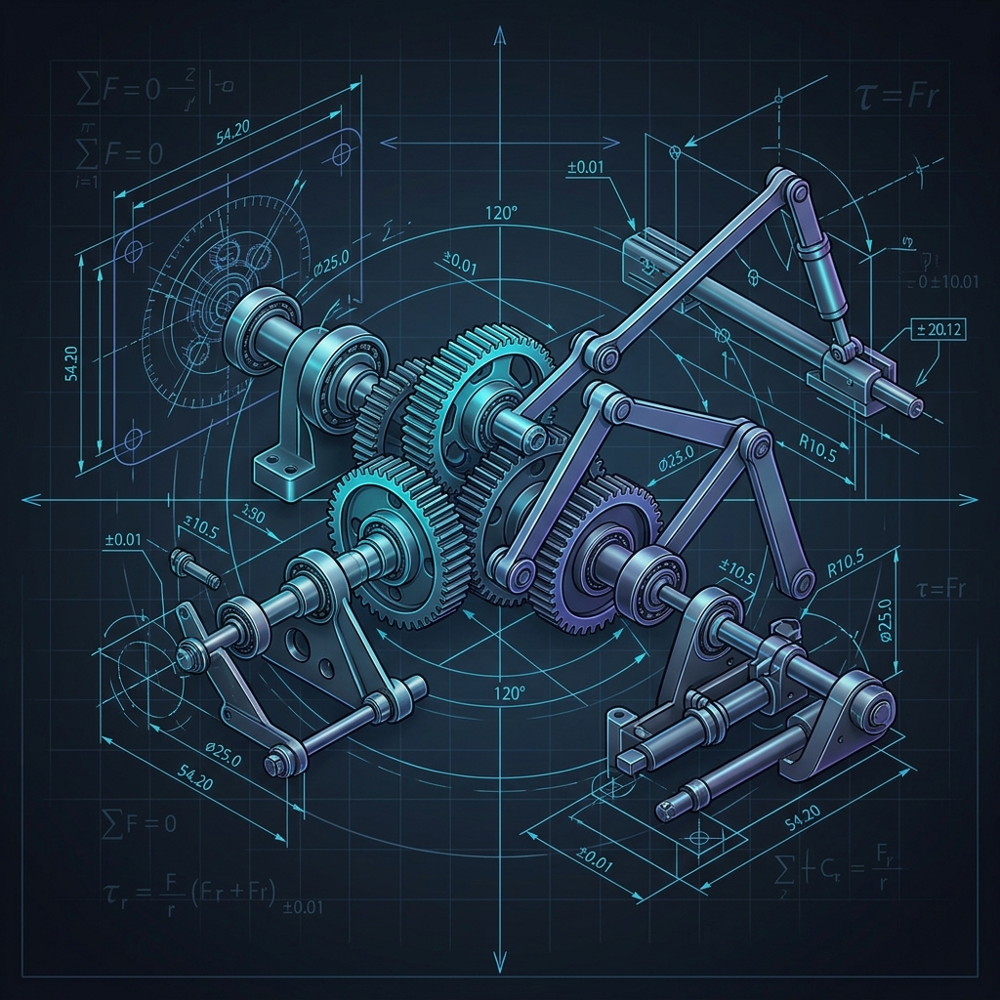
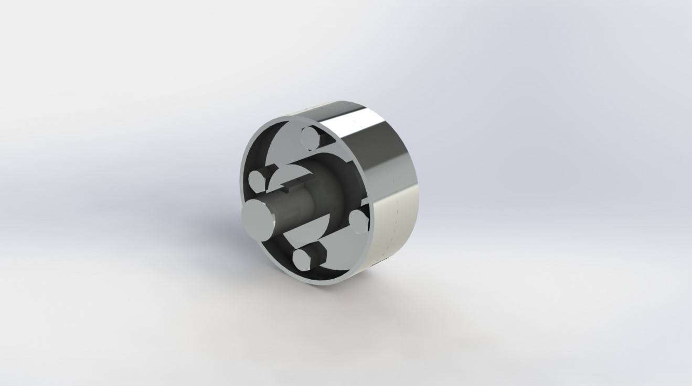
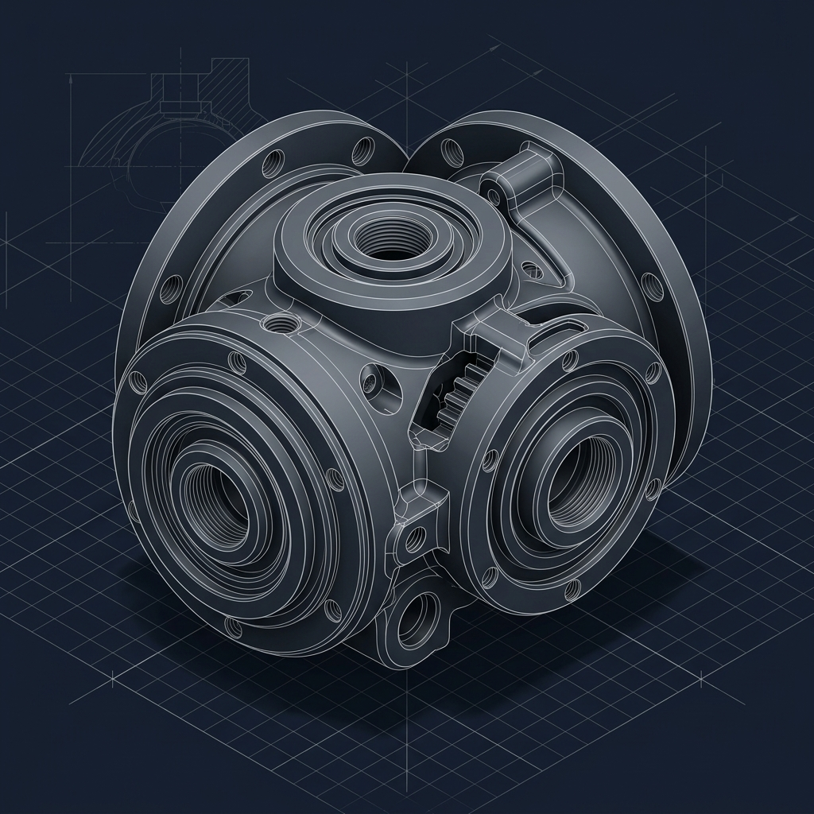

<h1 align="center">⚙️ Mechanical CAD Portfolio</h1>

  <b>Mechanical Engineering Undergraduate | CAD & Product Design Specialist</b>

  

  <a href="#about-me">About Me</a> &bull;
  <a href="#technical-skills">Technical Skills</a> &bull;
  <a href="#featured-projects">Featured Projects</a> &bull;
  <a href="CONTRIBUTING.md">Drafting Guidelines</a>

  
  
  
  

  <!-- GitHub Stats placeholders. Replace YOUR_GITHUB_USERNAME_HERE in the URLs once deployed -->
  
  

<b>🛠️ Click here to configure GitHub Stats Cards</b>

To activate the real-time GitHub Stats and Language cards:
1. Open this `README.md` file in edit mode.
2. Locate the two `github-readme-stats.vercel.app` image tags above.
3. Replace both instances of `YOUR_GITHUB_USERNAME_HERE` with your actual GitHub username.
4. Commit and push the changes.

---

## 🙋 About Me

Hello! I am a passionate **Mechanical Engineering Undergraduate** specializing in mechanical design, computer-aided drafting (CAD), and product development. My academic and project work focuses on translating physical design constraints into high-fidelity parametric 3D models and production-ready 2D engineering drawings.

With hands-on experience in **SolidWorks** and **AutoCAD**, I enjoy solving complex structural challenges, designing mechanical assemblies, and optimizing parts for manufacturing processes. I am eager to apply my skills in CAD design, drafting, and geometric dimensioning to real-world engineering problems through internships and full-time opportunities.

---

## 🛠️ Technical Skills

### 📐 CAD & Mechanical Design
| Skill Area | Details |
| :--- | :--- |
| **CAD Software** | SolidWorks (3D Parametric Part/Assembly modeling, Sheet Metal, Weldments), Autodesk AutoCAD (2D Drafting) |
| **Design Principles** | Assembly Design, Kinematic Mates, Interference Checking, Tolerance Stack-up Analysis, Product Development |
| **Technical Drafting** | Production-ready drawings, Orthographic & Section views, Bill of Materials (BOM), Assembly details |
| **Design Standards** | Geometric Dimensioning & Tolerancing (GD&T - Basic), ISO/ASME Standard compliance, Fit Classes (H7/g6) |

### 💻 Programming & Software Tools
| Tool Category | Details |
| :--- | :--- |
| **Programming Languages** | Python, C, C++ |
| **Development & Control** | Git, GitHub version control, Linux command line |
| **Hardware & Robotics** | Arduino microcontroller interfacing, ROS (Robot Operating System) basics |

---

## 📁 Featured Projects

<table width="100%">
  <tr>
    <td width="50%" valign="top">
      <h3>1. Protected Flange Coupling</h3>
      

        
      

      
<b>Description:</b> Fully defined, parameterized 3D assembly of a Protected Flange Coupling designed in SolidWorks. Features a protective outer lip shielding bolt heads for safety.

      
<b>Skills:</b> SolidWorks, Assembly Mates, 2D Drafting, GD&T, BOM

      
<b>Status:</b> ✅ Completed

      

        <a href="Projects/01_Protected_Flange_Coupling/">📂 Documentation</a> &bull; 
        <a href="Projects/01_Protected_Flange_Coupling/Assembly/">🔗 Assembly Files</a>
      

    </td>
    <td width="50%" valign="top">
      <h3>2. Bench Vice Assembly</h3>
      

        
      

      
<b>Description:</b> A high-precision workbench clamping tool designed to securely hold mechanical workpieces during machining operations.

      
<b>Skills:</b> Parametric Modeling, Thread Design, Tolerancing

      
<b>Status:</b> 🚧 Coming Soon

      

        <a href="Projects/02_Bench_Vice/">📂 Plan Docs</a>
      

    </td>
  </tr>
  <tr>
    <td width="50%" valign="top">
      <h3>3. Mechanical Screw Jack</h3>
      

        
      

      
<b>Description:</b> Heavy-duty portable lifting device utilizing a power square thread screw mechanism to lift vehicular loads and structures.

      
<b>Skills:</b> Power Screws, Thread Design, Friction Mates

      
<b>Status:</b> 🚧 Coming Soon

      

        <a href="Projects/03_Screw_Jack/">📂 Plan Docs</a>
      

    </td>
    <td width="50%" valign="top">
      <h3>4. Multi-Stage Spur Gearbox</h3>
      

        
      

      
<b>Description:</b> Speed reducer gearbox featuring spur gears, bearings, and shafts housed in a split-case cast housing for torque multiplication.

      
<b>Skills:</b> Gear Design, Bearing Fits, Shaft Keys

      
<b>Status:</b> 🚧 Coming Soon

      

        <a href="Projects/04_Gearbox_Assembly/">📂 Plan Docs</a>
      

    </td>
  </tr>
  <tr>
    <td width="50%" valign="top">
      <h3>5. Universal Joint (Hooke's Joint)</h3>
      

        
      

      
<b>Description:</b> Mechanical coupling designed to transmit power between two shafts having angular misalignment.

      
<b>Skills:</b> Kinematic Links, Yoke Modeling, Pins

      
<b>Status:</b> 🚧 Coming Soon

      

        <a href="Projects/05_Universal_Joint/">📂 Plan Docs</a>
      

    </td>
    <td width="50%" valign="top">
      <h3>6. Oldham Coupling Assembly</h3>
      

        
      

      
<b>Description:</b> Mechanical coupling used to connect two parallel shafts with lateral misalignment, using a sliding center disc.

      
<b>Skills:</b> Floating Disc Design, Fits, Keyways

      
<b>Status:</b> 🚧 Coming Soon

      

        <a href="Projects/06_Oldham_Coupling/">📂 Plan Docs</a>
      

    </td>
  </tr>
  <tr>
    <td width="50%" valign="top">
      <h3>7. Connecting Rod & Piston</h3>
      

        
      

      
<b>Description:</b> Core reciprocating assembly of an internal combustion engine, transforming linear cylinder expansion into rotary motion.

      
<b>Skills:</b> Reciprocating Parts, Wrist Pins, Structural Shapes

      
<b>Status:</b> 🚧 Coming Soon

      

        <a href="Projects/07_Connecting_Rod_and_Piston/">📂 Plan Docs</a>
      

    </td>
    <td width="50%" valign="top">
      <h3>8. Bearing Housing (Plummer Block)</h3>
      

        
      

      
<b>Description:</b> Pedestal-type bearing housing designed to support rotating shafts with split brass bushings under high loads.

      
<b>Skills:</b> Casting Design, Split Bushings, Lubrication Inlets

      
<b>Status:</b> 🚧 Coming Soon

      

        <a href="Projects/08_Bearing_Housing/">📂 Plan Docs</a>
      

    </td>
  </tr>
</table>

---

## 📈 Education & Certifications

*   **Bachelor of Technology / Engineering in Mechanical Engineering**
    *   *Duration*: 2024 - 2028 (Undergraduate)
    *   *Core Coursework*: Solid Mechanics, Machine Design, Fluid Mechanics, Theory of Machines, Computer Aided Design (CAD), Manufacturing Processes.
*   **Certifications** (Details located in [Certifications/](Certifications/))
    *   SolidWorks Certified Associate (CSWA) / Certified Professional (CSWP) - *Planned*
    *   AutoCAD Certified User - *Planned*

---

## 📄 Resume / Contact

*   **Resume**: Latest PDF available in [Resume/](Resume/)
*   **LinkedIn**: `linkedin.com/in/YOUR_LINKEDIN_URL`
*   **Email**: `your.email@example.com`
